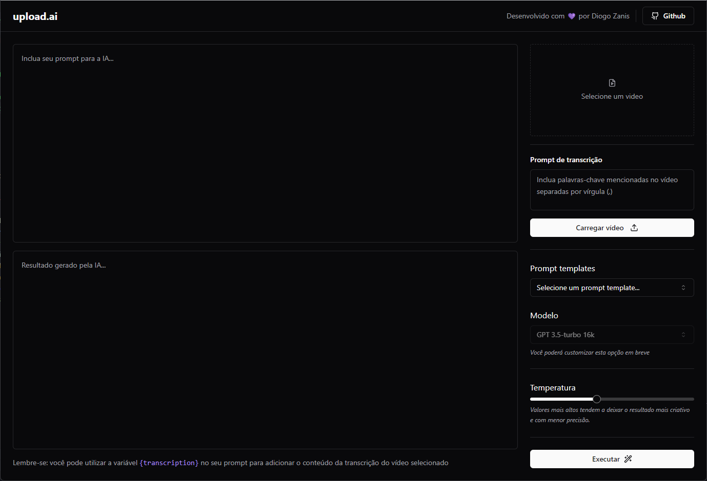

# 🎞️ Upload.ai

## 💻 Projeto

Esta aplicação é um playground utilizando inteligência artifical. Que carrega e faz a transcrição de vídeos, para gerar sugestões de títulos, descrição, resumo, entre outras opções desejadas. Através de prompt templates personalizados e o ajuste fácil do nível de criatividade (temperatura) ou assertividade da IA.

 

> NLW AI - Trilha Mastery 🚀

Projeto desenvolvido como exercício durante o bootcamp NLW AI, trilha Mastery, que ocorreu entre 11 e 17 de setembro de 2023.

O NLW (Next Level Week) é um evento online de programação na prática da escola Rocketseat.

 

## 🛠 Principais Tecnologias

- React
- Node.js
- Typescript
- Tailwind
- Fastify
- Prisma
- SQLite

## 🧡 Contato

Diogo Zanis :wave: [LinkedIn](https://www.linkedin.com/in/diogo-zanis-51539a121)
